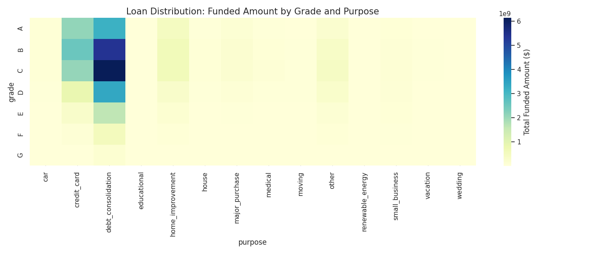
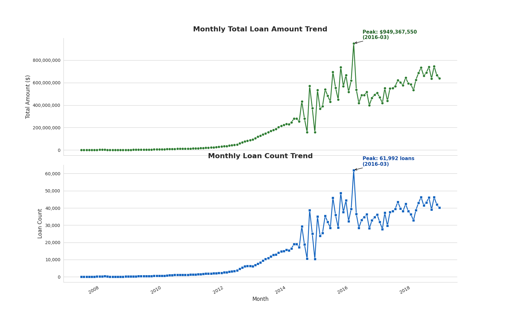
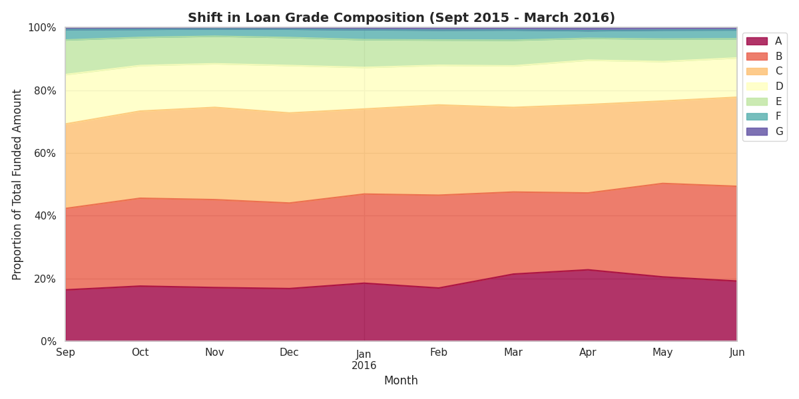
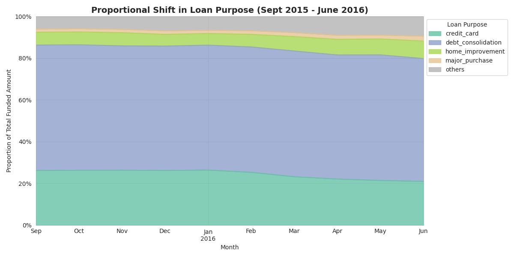
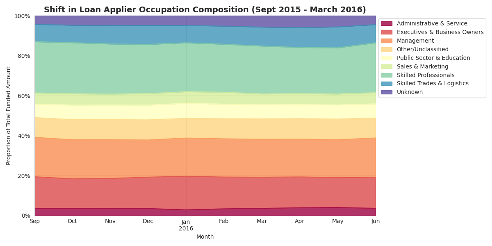
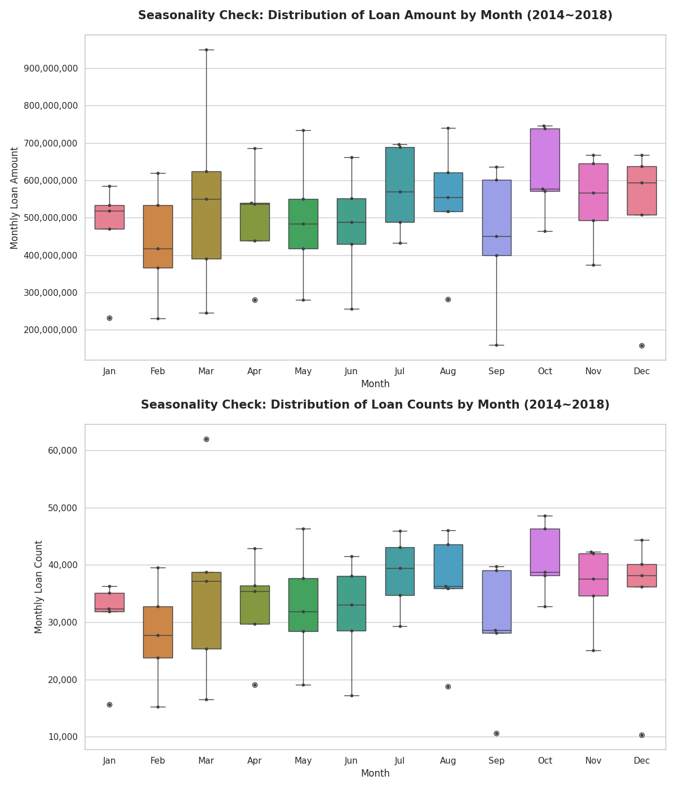
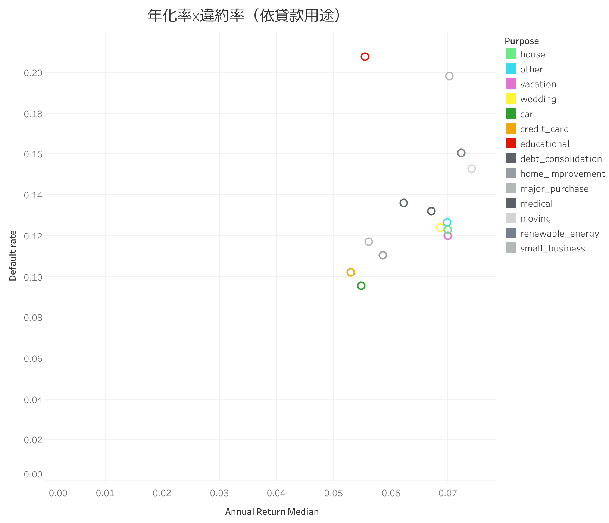

# 背景概覽
Lending Club 是美國 P2P 網路借貸的先驅，直接連接個人及機構投資者與尋求無擔保個人貸款的借款人，過自建演算法與導入 FICO 信用評分系統，期望透過創新來改革消費信貸市場，並取代傳統銀行的信貸業務。

結合 FICO 以及自建的風險評估演算法，Lending Club 會根據借款人的信用狀況評定信用評等（範圍從 A 到 G）。平台因此能為借款人提供較低的利率，同時為投資者提供高 ROI 的金融工具。Lending Club 的收入來源主要仰賴對每筆貸款收取 **1% 的服務費**；然而，若借款人逾期未還款，則可能產生額外的催收費用。這些費用包括追回金額的 8% 以及 30% 的法律費用，必要時還需支付額外支出。2018 年的貸款總額已達到 **79 億美元**，而 ＊2015 年貸款人的年度報酬率（中位數）為 **5.3%**。

本報告向**行銷、產品及財務部門主管呈報**，針對 Lending Club 過去幾年（2007-2018）的表現進行了深度分析，並期望以此作為後續行動與跨部門合作的參考，以提升 Lending Club 的整體表現。分析與建議主要集中於以下領域：

### 北極星指標
- **獲利能力**： 因 Lending Club 以手續費收益為主，追蹤**貸款總額**與**貸款件數**的趨勢可以了解整體的收益狀況。
- **平台永續性**： 著重於**名目利率**、**年度報酬率**（中位數）與**違約率趨勢**等關鍵指標，確保貸款人權益。
- **客戶分層**： 透過分析不同**職業類別**與**貸款目的**的表現，識別平台上的主要參與者與潛力黑馬。
- **市場滲透率**： 評估各州的**人均貸款金額 、平均貸款金額、人均貸款件數** ，以尋找開發不足市場中的**成長機會**。

> **＊備註：** 由於此資料集最只紀錄到 2018 年，而 Lending Club 的貸款期限為 36 或 60 個月，因此 2015 年以後結算的貸款將不計入報酬率計算，因為後續這些貸款皆屬於壞帳，會誤導該期間發行貸款的實際報酬率表現。

# 摘要：LendingClub 營運概況與建議方案 

### 1. 營運趨勢與成長動能分析

* **貸款量高峰成因：** 2016 年 Q1 貸款量達到頂峰，主要受宏觀經濟（聯準會升息預期）與平台策略影響。數據顯示，該時期的成長核心來自 **A-C 級優質信貸（佔比提升 10%）**。這反映出公司在升息環境下，採取「以量補價」策略，透過核准更多低風險、低利率的優質貸款來留住投資人。
* **季節性壓力週期：** 貸款需求呈現顯著的「延遲財務壓力」規律。**10 月為全年申請量與金額的最高峰**，主因是夏季支出累積與年底節慶焦慮的雙重擠壓。建議行銷部門將「債務整合」的廣告投放提前至 **9 月下旬**，以在競爭對手反應前精準捕捉潛在客群。

### 2. 產品組合與獲利能力優化

分析顯示目前產品線存在顯著的利潤不均現象，需進行差異化管理：

* **【高價值產品】婚禮信貸：** 數據證實婚貸具備「低違約、高報酬」特質（推測受雙薪還款與心理價值驅動）。目前定價對借款人而言相對較高，建議產品部門考慮**適度下調 APR** 以提升市場競爭力，獲取更多市佔率。
* **【邊際產品】教育貸款：** 該類別年化報酬率（6.76%）顯著低於平均，且逾半數表現不佳。需釐清其作為「招徠品 (Loss Leader)」的交叉銷售轉化率。若無法量化其帶來的長期價值（LTV），應考慮縮減或退出該產品線。
* **【獲利風險】利差收縮：** 2013 年後實質報酬與名義利率利差擴大，除了壞帳回收率可能下降外，高信用評等客群的「提前還款」亦是關鍵成因。建議追蹤 2018 年後的提前還款率，以修正定價模型。

### 3. 市場擴張機會：猶他州 

透過「需求潛力（高單筆金額）」與「滲透率（低人均件數）」交叉篩選，**猶他州**被識別為唯一具備開發潛力的藍海市場。

* **驗證結論：** 經分析排除信用等級與貸款用途的偏誤後，確認猶他州借款人素質與全美一致。
* **後續行動：** 需進一步引入外部數據（競爭對手分佈、搜尋趨勢）來判斷滲透率低的原因是「競爭者壟斷」還是「品牌認知度不足」。

### 4. 數據基礎建設優化 

目前的分析受限於職稱欄位（`emp_title`）的自由輸入格式，導致客戶輪廓分析精準度受限。

* **技術請求：** 建議開發部門將職稱改為「產業」與「職級」的下拉式選單。
* **預期效益：** 此調整將大幅提升 Data Pipeline 自動化效率，並支持行銷團隊進行更高轉化的精準客群投放。

# 趨勢與營運狀況分析
## 獲利能力

總體而言，貸款量高度集中在「債務整合」的 B、C 級貸款。

### 貸款量趨勢分析

2016 三月，Lending Club 的借款金額與數量都來到了頂點。我們將嘗試從既有資料進一步尋找成因。
相較於較容易會有季節性波動（報稅季、感恩節與黑色星期五等）的貸款用途，信貸等級通常比較穩定，其波動更能反映出公司政策或是整體環境的變動，因此先嘗試分析信貸等級的分布變化。

與 2015Q4 相比，2016Q1（3月）核准的 A 級信貸比例約上升 5%，其他級別的信貸則無明顯改變。截至2016Q2（6月），信貸整體品質有逐漸提升的趨勢，A-C 級信貸整體佔比上升了約 10%，顯示 LendingClub 在貸款量達到高點前後的成長貢獻多源自於信用良好的借貸者。

由圖所示，貸款用途及職業組成的結構並未發現明顯的變動。

結合貸款等級組成的變動以及當時總體經濟環境概況，可以初步推論造成 2016Q1 貸款量高峰背後的因素。

2015 年底，聯準會啟動升息循環時，由於銀行和機構投資人的借貸成本上升，他們就更不願意把錢放在高風險、低報酬的地方。另一方面，他們也擔心升息會導致經濟放緩，會導致平台上信用差借款人更容易違約。因此 LendingClub 若要留住機構與散戶投資人，就必須提供更安全的信貸，因此在策略上專注於提高高級信貸，主動篩選並核准更多 A、B 級的優質借款人。

然而，由於高級貸款風險與利率皆低，因此整體信貸組成轉變所產生的利差，會使得 LendingClub 需要吸引更大的貸款量來彌補單筆利潤的下降。在未來升息的預期下，借款人也會傾向於在 Q1 提前貸款來獲得更優惠的利率。綜合上述，總經環境的改變驅動了借款人的需求與 LendingClub 的供給，導致了貸款量在 2016Q1 達到頂峰。

### 貸款量季節性分析

貸款申請量具有特定規則：7 月與 8 月出現中度高峰，9 月顯著下滑，隨後在 10 月迎來全年最高的申請量。值得注意的是，10 月的貸款金額超越了夏季高峰，顯示貸款金額的季節性並非單純的線性規律。
#### 假說設定
此模式可以被視為由延遲的財務壓力所導致的規律，而非單純的季節性變動。其背後的邏輯可分為三個階段：

1. **夏季（7月至8月）：** 由於直接的貸款觸發事件（如居家修繕、婚禮及度假融資）產生了第一個高峰。然而，由於借款人仍處於支出過程中，完整的財務壓力尚未完全顯現，因此這個高峰相對溫和。
2. **9月：** 出現下滑是由於財務壓力的滯後現象。隨著學校開學與工作節奏恢復，借款人進入短暫的樂觀期。儘管夏季帳單雖已寄達，但借款人因為清算期限還沒到，因此尚未採取行動，認為自己可以獨立處理還款。
3. **10月：** 結合夏季與年末的兩股支出壓力，形成了全年的最高峰。首先，7 月至 9 月累積的信用卡債務變得不可忽視，驅動了債務整合信貸的需求；其次，對第四季假期支出（購物、旅行、年終帳單）的預期焦慮，促使財務吃緊的借款人在更多債務到來前主動採取行動。
#### 進一步分析方向

針對違約率進行假說驗證。10 月撥款的貸款（由財務壓力驅動而非計畫性借貸）其違約風險可能高於年平均值。若經證實，將會影響旺季的風險定價與核貸準則。

## 平台永續性：利率、年化報酬率與壞帳率

**觀察結果**：數據顯示從 2013 年開始，貸款人的實質年利率（APR）與名義貸款利率（Nominal Interest Rate）之間的利差隨時間擴大，然而違約率僅有小幅增加，顯示違約頻率並非貸款人報酬率下降的唯一成因。
### 可能成因 1：壞帳率上升
當貸款違約時，Lending Club 通常會透過將債權出售給催收機構來回收部分未償餘額。這項回收率是貸款人收益中重要但常被忽視的組成部分。若壞帳率在 2018 年上升（例如呆帳中每借出的 $1 就損失 $0.1 提高到 $0.5）那麼即使違約率保持穩定，違約對貸款人造成的淨損失也會增加。
- **後續行動：** 追蹤各年度沖銷貸款的壞帳率。若呈現上升趨勢，即可證實此為主要驅動因素。

### 可能原因 2：高信用評等借款人的提前還款風險 
貸款人的實質 APR 是基於借款人在完整貸款期限內還款的假設來建模的。當高信用評等（A/B 級）借款人提前清償或轉貸時，貸款人會失去原先預計賺取的未來利息；此外，退回的資金在重新投資前會處於閒置狀態，產生現金拖累而影響收益。

例如：若 A 級借款人在 2018 年加速提前還款（可能受其他管道轉貸利率下降所影響），貸款人的收益將在最高品質的客群中下降。
- **後續行動：** 檢視各評等隨時間變化的提前還款率。若 2018 年提前還款量激增，將支持此項假設。
## 客戶分層

在所有貸款用途中，房貸、假期、婚貸與其他信貸都是實際風險相對低且高報酬的。另一方面，卡債貸款、車貸的 APR 中位數也是在各個用途中表現最差的。學貸則是同時擁有最高的平均違約率以及較低的回報率。
### 1. 婚禮信貸：利潤最高的信貸類別
**分析發現**：依照級別分組比較不同用途的信貸後，發現 D、E 級婚貸的年化報酬率與違約率都顯著優於同組的其他信貸。
**管理意涵**：高利率與低違約率鮮少同時存在。最可能的解釋是：
1. 雙薪還款（婚禮貸款通常有共同簽署人）
2. 借款人對此類重大生命事件有較高的還款動機
然而無論原因為何，婚禮信貸雖然實際風險低，他們的申請人卻普遍負擔了更高的利率 。另一方面，放貸給婚禮信貸比其他用途信貸的投資人風險報酬率更高，對於 Lending Club 也是如此。

### 2. 教育貸款：控管低收益產品 (Loss Leader)
- **分析發現**：教育貸款產生的平均年化報酬率為 6.76%，低於投資組合整體平均值 7.63%。經過分析過後發現 C-F 級，也就是學貸中超過五成（51.3%）的年化報酬率都顯著低於其他用途的信貸。
- **管理意涵**：教育貸款目前可能被當作招徠品（Loss Leader），刻意以低於平均的報酬獲取客戶，並期望未來能進行其他產品的交叉銷售。目前尚不清楚這是刻意的戰略還是單純地表現不佳。若實際上是後者，則應該考量是否要撤出該產品線。

## 市場滲透率：猶他州作為潛在的新興市場
### 指標與篩選邏輯
為了找出 Lending Club 目前開發不足的區域市場，我們同時採用兩項條件進行篩選：**平均貸款金額**高於全美各州的前 25%，且**人均貸款件數**低於全美各州的前 25%。此組合旨在找出那些「存在貸款需求（以單筆金額為指標），但整體滲透率仍然較低」的市場。猶他州是唯一符合這兩項條件的州，並且在接下來初步檢驗這個

### 核心假設
我們需要先透過驗證以下假設，才能確認是猶他州是否實際上仍有開發機會。換句話說，即是確認高平均貸款金額反映的是「真實的高品質借款需求」，而非選擇偏誤所帶來的結果。若 Lending Club 在猶他州的品牌認知度較低，可能只有需求極高而去刻意找尋借款管道的借款人會接觸到 Lending Club 並完成申請流程，因而拉高平均貸款金額，而無法代表廣泛的基礎需求。

#### 假設一：貸款等級組成

猶他州的貸款評等分布與全美平均水準高度一致，因此我們可以排除「猶他州平均貸款金額較高是由於 A/B 級高收入借款人比例過高」的可能性。
#### 假設二：貸款用途組成

猶他州的貸款用途細分同樣與全國用途分布並無明顯差異，因此我們可以排除「猶他州借款人因借貸習性不同，而在特定事件上有較高資金需求」的解釋。猶他州的借款動機與其他地區基本相同。
### 結論
上述兩項驗證可以得到一致的結論：從需求端而言，**猶他州借款人在信用素質或貸款用途上與全國人口並無特定差異，但接觸到 Lending Club 的人數卻遠低於平均。**

這種現象可能反映了「市場滲透率有限」的問題（品牌知名度低、競爭對手主導或缺乏通路），而非整體需求低迷。因此，後續值得針對猶他州的信貸供給端進行進一步的調查，包括競爭對手現況、搜尋關鍵字趨勢數據以及人口統計趨勢等等，以確定這是一個值得抓住的擴張機會，還是是因為存在難以排除的障礙。
# 策略建議

## 在 9 月針對債務整合客群加強廣告投放
若違約率或其他數據能夠財務壓力週期的假說，建議採取以下行動：
- **行銷部門：** 將獲客廣告投放提前至 9 月下旬，在 10 月高峰完全顯現前，鎖定財務焦慮感上升的借款人。早期接觸這些向借款人能避開競爭對手的干擾，且他們對「債務整合」的訊息接受度更高，可提升轉換效率。

## 加強針對婚貸客群的行銷
- **行銷部門：** 將獲客預算轉向婚禮登記平台和婚禮籌備網站。結合各區域與季節性的婚姻活動數據，優化預算配置。
- **財務、產品部門：** 確認婚禮貸款的年利率（APR）結構。若經風險調整後的報酬確認定價過高，可以適度降低 APR 可以在不犧牲獲利的情況下，透過利率優惠來增加對於 TA 的誘因、削弱其他競爭者的吸引力。
  
## 調整學貸的產品策略
- **行銷部門：** 調查學貸借款人轉換到 Lending Club 其他產品的比例，是否顯著高於平均借款人。若是為了後續的顧客終身價值（LTV）而補貼目前的獲客成本（CAC），應將其量化並制定為明確戰略，而非放任學貸成為未來不明的落水狗商品。
  
## 驗證猶他州信貸市場開發的可行性
目前的內部資料分析已排除「信用品質差異」與「借款動機差異」作為平均借款金額較高的解釋，指向猶他州存在市場滲透率不足的可能性。但「滲透率不足」本身有兩種截然不同的原因：**需求已被競爭對手填補**，或**需求尚未被任何人充分服務**。由於這兩種情況對應完全不同的行動方向，因此需要外部資料才能區分。以下可以分成三個面向來驗證：
- 競爭對手現況：透過 SimilarWeb 了解市場趨勢與競爭者策略來確認市場是否目前被傳統銀行或其他 fintech 主導。
- 整體搜尋與流量：透過 Google Trends 來了解是「搜尋量高但轉換率低」還是區域需求原先就較低迷。
- 人口結構趨勢：透過人口預測等資料了解較高的平均貸款金額是否受到人口或個經因素驅動（家庭規模大、年輕人口多、房價上漲）。

## 改善 Data Pipeline 與資料品質
- **軟體開發部門**：由於目前客戶資料的建置表單中職稱欄位（`emp_title`）為自由輸入，難以依照內容確切辨認其產業、確切職稱或層級，同樣的職位也可能會有多種不一樣的稱呼。因此目前只依照內容進行大致分類，顧客輪廓也可能不精準，難以進行進一步的分析。因此將會需要請求軟體開發部門修改顧客基本資料的表單，將職稱改為產業以及職位的下拉表單。這不僅能大幅提升Data Pipeline 的自動化效率，更能協助行銷團隊進行精準投放。

# 附件
儀表板原型
